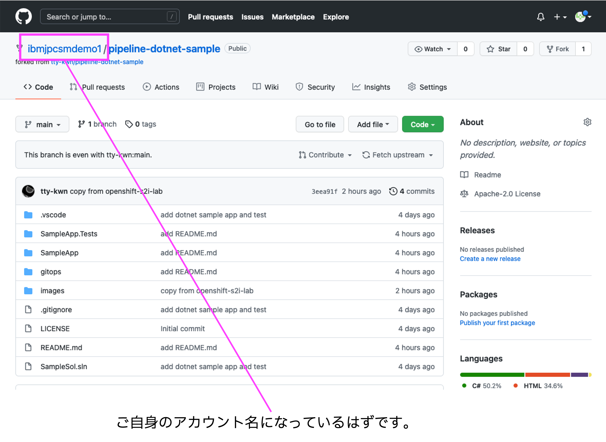

# OpenShift 初めてのPipeline/GitOps ハンズオン

## 前提条件

本ハンズオンワークショップは、OpenShiftもしくはKubernetesに触れたことがある方を対象としています。

OpenShiftに触れたことが無い方は、まずはぜひ、我々のハンズオンワークショップ [Tech Dojo OpenShift - Self Study](https://ibm-developer.connpass.com) にて OpenShiftをご体感ください。基本的に、毎週水曜日午前に実施しております。

## 座学

[TODO:Pipelineとは?GitOpsとは?の資料をパワポで作成し、PDFで貼り付ける](test.pdf)

## ハンズオンワークショップの流れ

1. ワークショップの準備
2. ソースコードのFork
3. アプリケーションのDeploy
4. Webhookの設定
5. ソースコードの修正及びDeploy(⾃動）

## 1. ワークショップの準備

下記ページの内容に沿って、ハンズオンワークショップの準備を実施ください。

[ハンズオンワークショップ - 準備](https://github.com/IBMDeveloperTokyo/openshift-s2i-lab/blob/main/PREPARE.md)

IBM CloudライトアカウントおよびGitHubアカウントの作成、OpenShiftクラスタの表示ができれば準備は完了です。

## 2. ソースコードのFork
ここからはGitHubへアクセスして自分のリポジトリへサンプルソースコードをForkしていきます。

### 2.1 GitHubへのサインイン
GitHubにサインイン(Sign in)してください。まだアカウント登録されていない方は[こちら](https://github.com/)からサインアップ(Sign up)してください。 

### 2.2 リポジトリーのFork
ブラウザーで[https://github.com/tty-kwn/pipeline-dotnet-sample](https://github.com/tty-kwn/pipeline-dotnet-sample)を開いてください。 
[Fork]ボタンをクリックして、自分のアカウントを選択してください。

### 2.3 自分のリポジトリーの確認
Forkする際に指定した自分のリポジトリーへ、対象のプロジェクトがForkされたことを確認します。 
リポジトリーのパスの最初の部分が自分のGitHubアカウントになっていればOKです。

## 3. Pipelineの作成
ここからは、先程用意したOpenShiftの環境へ、自分のGitHubリポジトリーにあるアプリケーションをデプロイします。

### 3.1 OpenShift Projectの作成
OpenShiftのWebコンソールへ戻り、[プロジェクト]ボタンをクリックします。 
その後[Projectの作成]ボタンをクリックするとCreate Project画面が開きますので、任意のプロジェクト名を入力し[Create]ボタンをクリックしてください。 なお、Nameにはすべて小文字をお使いください。

### 3.2 OpenShiftユーザータイプの切り替え
左上のメニューにて、[管理者]から[Developer]に切り替えます。 
切り替えたら[ソース:Git]をクリックしてください。

### 3.3 デプロイするアプリケーションのソースコードを指定
先ほどコピーした、自分のGitHubリポジトリーのURLを[GitリポジトリーURL]に入力します。 
下の[詳細のGitオプションの表示]をクリックすると入力エリアが展開するので、[コンテキストディレクトリー]に「/SampleApp」と入力してください。 
今回デプロイする対象のアプリケーションはGitHubリポジトリー[https://github.com/tty-kwn/pipeline-dotnet-sample](https://github.com/tty-kwn/pipeline-dotnet-sample)の「SampleApp」ディレクトリ配下のため、ここでディレクトリを指定します。

### 3.4 デプロイするアプリケーションのタイプを選択
言語やタイプの一覧がタイルで表示され、.Netが選択されていることを確認します。今回GitHubリポジトリーへForkしたプロジェクトは.Net Coreアプリケーションだからです。 
選択したら最下段の[作成]ボタンをクリックしてください。（他のオプションはすべてデフォルトで構いません)

TODO: ここ大事！要修正

### 3.5 アプリケーションのデプロイ
アプリケーションのデプロイが始まります。1分弱お待ちください。中の丸が青くなったら完成です。丸の中をクリックすると右側にメニューが出てくるので[Routes]の下のURLをクリックするとWebへ公開されたアプリケーションへアクセスできます。

### 3.6 アプリケーションへのアクセス
デプロイされ、Webへ公開されたアプリケーションへアクセスできました。 
実際にこのアプリケーションへログインしてみましょう。ID,Passwordともに「test」と入れてログインしてください。 
医療関連のデータを管理するサンプルアプリケーションへログインできたかと思います。

ここまでで、GitHub上のソースコードをダイレクトにOpenShiftへデプロイする方法を学びました。

## 4. Webhookの設定
ここでは、GitHub上のソースコードが変更された際に、自動的にOpenShiftへデプロイされるようにWebhookをGitHub上へ設定していきたいと思います。

### 4.1 OpenShiftのWebhook URLの取得
OpenShiftのWebコンソールへアクセスします。左側のメニューから[ビルド]を選択し、右側のワークスペースに表示される[node-build-config-openshift]をクリックします。

下にスクロールして一番右の[Copy URL with Secret]をクリックしてWebhookのURLとSecretをクリップボードにコピーしてください。

### 4.2 GitHubにWebhookを設定
GitHubの自分のリポジトリーへ戻り、[Settings] -> [Webhooks] -> [Add webhook]を選択します。

先ほどクリップボードにコピーしたURL+secretを[Payload URL]に貼り付けてください。[Control type]は[application/json]を選択してください。

入力後、[Add webhook]を選択します。 
以下の図の様に緑のチェックマークが付いたら設定成功です。（チェックマークが表示されない場合はページを再読み込みしてください。）

これでwebhookの設定は完了です。後はソースコードの修正で自動的にアプリケーションがデプロイされます。

## 5. ソースコードの修正及びDeploy(自動)
最後に、GitHub上のソースコードを修正し、それが自動でOpenShiftへ反映されることを試していきます。

### 5.1 ソースコードの修正
GitHubの自分のリポジトリ画面から[Site]フォルダーを選択します。

[public]フォルダ配下の[index.html]を選択しペンのアイコンをクリックして編集モードにします。 
ここでは、GitHubのGUIから編集を行いますが、ローカルにcloneして編集したファイルをcommit、pushしてもOKです。

変更点をクイックに確認するために、ここでは23行目の英文「Example Health」を日本語の「医療管理」に変更してみます。 
変更したらコミットしてください。自分所有のリポジトリーなので、そのまま反映されます。

OpenShiftのWebコンソールへ戻り、左側の[トポロジー]を確認すると、再度デプロイがおこなわれていることが分かります。

再デプロイが完了したらデプロイしたアプリケーションを起動し直してください。（既に表示されている場合はリロードしてください） 
アプリケーション内にある見出しが「Example Health」から「医療管理」に変更されたことが確認できました。

お疲れさまでした！これで、OpenShiftのS2Iを使ったハンズオンワークショップは完了です。

## その他のアプリケーション
もし、PHPのサンプルアプリケーションで試してみたい方は下記のリポジトリーのソースコードを試してみてください。
[https://github.com/osonoi/php-s2i-openshift](https://github.com/osonoi/php-s2i-openshift)

