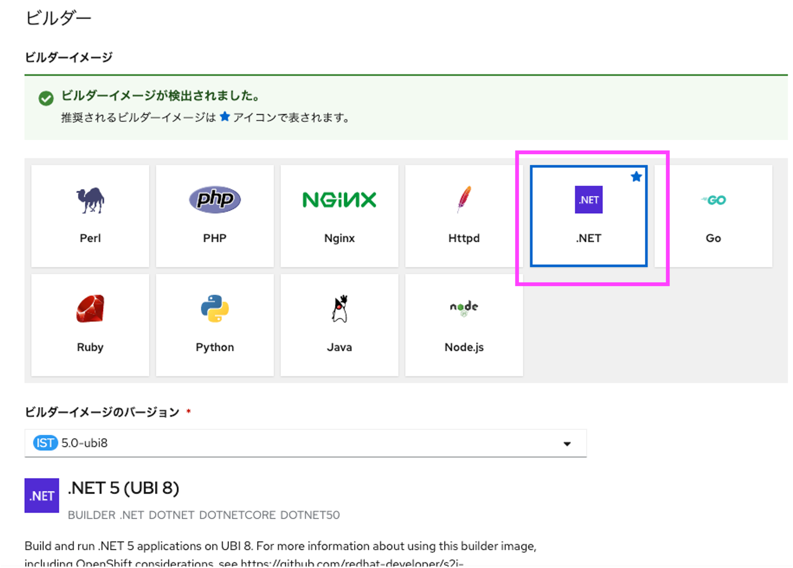
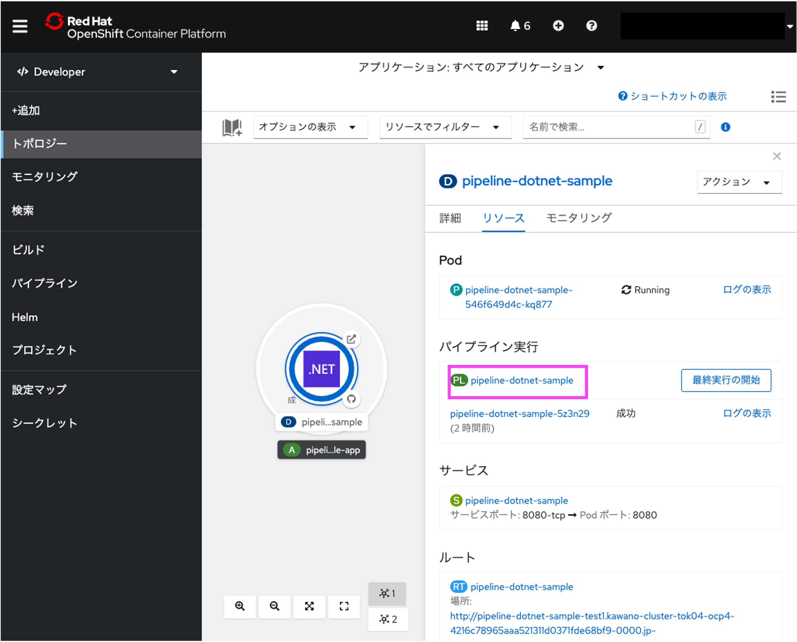
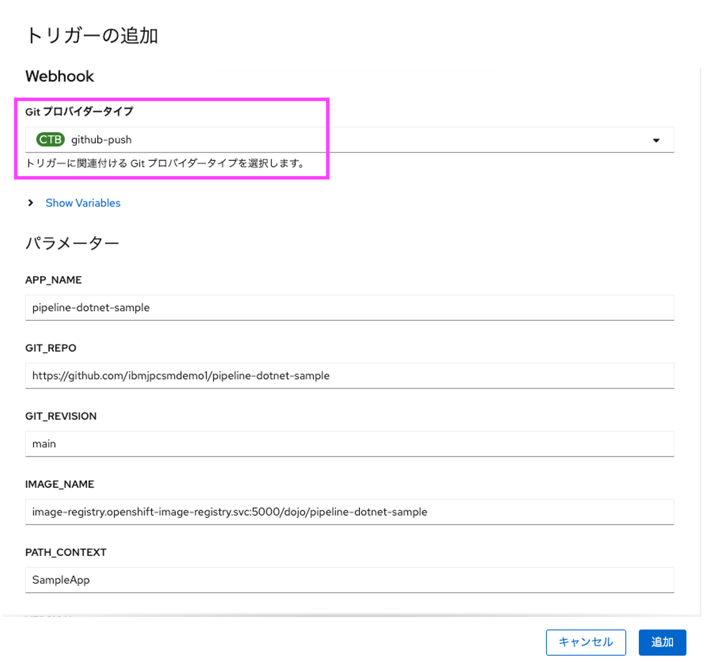

# OpenShift 初めてのPipeline/GitOps ハンズオン

## 前提条件

本ハンズオンワークショップは、OpenShiftもしくはKubernetesに触れたことがある方を対象としています。

OpenShiftに触れたことが無い方は、まずはぜひ、我々のハンズオンワークショップ [Tech Dojo OpenShift - Self Study](https://ibm-developer.connpass.com) にて OpenShiftをご体感ください。基本的に、毎週水曜日午前に実施しております。

## 座学

[TODO:Pipelineとは?GitOpsとは?の資料をパワポで作成し、PDFで貼り付ける](test.pdf)

## ハンズオンワークショップの流れ

1. ワークショップの準備 (10分)
2. ソースコードのFork (5分)
3. Red Hat OpenShift Pipelines Operatorのインストール (5分)
4. アプリケーションのDeploy (20分)
5. トリガーの設定と動作確認 (15分)
6. テストタスクの作成及びパイプライン実行 (5分)
7. テストソースの修正及びパイプライン自動実行 (10分)
8. (時間に余裕のある人向け) OpenShift GitOpsインストール (2分)
9. (時間に余裕のある人向け) ArgoCDへのアプリ設定とデプロイ実行 (10分)

## 1. ワークショップの準備

下記ページの内容に沿って、ハンズオンワークショップの準備を実施ください。

[ハンズオンワークショップ - 準備](https://github.com/IBMDeveloperTokyo/openshift-s2i-lab/blob/main/PREPARE.md)

IBM CloudライトアカウントおよびGitHubアカウントの作成、OpenShiftクラスタの表示ができれば準備は完了です。

## 2. ソースコードのFork

ここからはGitHubへアクセスして自分のリポジトリへサンプルソースコードをForkしていきます。

### 2.1 GitHubへのサインイン

GitHubにサインイン(Sign in)してください。まだアカウント登録されていない方は[こちら](https://github.com/)からサインアップ(Sign up)してください。 

### 2.2 リポジトリーのFork

ブラウザーで[https://github.com/tty-kwn/pipeline-dotnet-sample](https://github.com/tty-kwn/pipeline-dotnet-sample)を開いてください。 
[Fork]ボタンをクリックして、自分のアカウントを選択してください。

### 2.3 自分のリポジトリーの確認

Forkする際に指定した自分のリポジトリーへ、対象のプロジェクトがForkされたことを確認します。 
リポジトリーのパスの最初の部分が自分のGitHubアカウントになっていればOKです。

## 3. Red Hat OpenShift Pipelinesのインストール

ここからは、OpenShiftにOpenShift Pipelinesをインストールします。

### 3.1 Operatorの検索

OpenShiftのWebコンソールへ戻り、[OperatorHub]ボタンをクリックします。

インストール可能なOperatorがタイル表示されています。 
[Filter by keyword..]に「OpenShift Pipelines」と入力し、Red Hat OpenShift Pipelinesを選択します。

[インストール]をクリックします。

### 3.2 Operatorのインストール

すべてデフォルトのままで、[インストール]をクリックします。

インストール完了のダイアログが表示されれば、作業は完了です。

## 4. Pipelineの作成

ここからは、先程用意したOpenShiftの環境へ、自分のGitHubリポジトリーにあるアプリケーションをデプロイするpipelineを作成します。

### 4.1 OpenShift Projectの作成

OpenShiftのWebコンソールへ戻り、[プロジェクト]ボタンをクリックします。

その後[Projectの作成]ボタンをクリックするとCreate Project画面が開きますので、任意のプロジェクト名を入力し[Create]ボタンをクリックしてください。

なお、名前にはすべて小文字をお使いください。

### 4.2 OpenShiftユーザータイプの切り替え

左上のメニューにて、[管理者]から[Developer]に切り替えます。

切り替えたら[+追加]をクリック、[ソース:Git]をクリックしてください。

### 4.3 デプロイするアプリケーションのソースコードを指定
先ほどコピーした、自分のGitHubリポジトリーのURLを[GitリポジトリーURL]に入力します。

下の[詳細のGitオプションの表示]をクリックすると入力エリアが展開されます。

今回デプロイする対象のアプリケーションは[GitHubリポジトリー](https://github.com/tty-kwn/pipeline-dotnet-sample)の「main」ブランチ及び「SampleApp」ディレクトリ配下のため、以下の通り入力します。

| 項目 | 入力値 | 説明 |
| ---- | ---- | ---- |
| [Gitリファレンス] | main | ブランチ名 |
| [コンテキストディレクトリー] | /SampleApp | アプリケーションディレクトリ |

### 4.4 デプロイするアプリケーションのタイプを選択

言語やタイプの一覧がタイルで表示され、.NETが選択されていることを確認します。今回GitHubリポジトリーへForkしたプロジェクトは .Net Core アプリケーションだからです。

### 4.5 パイプラインの追加

[パイプラインの追加]をチェックします。これにより、ビルドとデプロイをOpenShift Pipelineを用いて行うようにできます。

チェックしたら最下段の[作成]ボタンをクリックしてください。（他のオプションはすべてデフォルトで構いません)

### 4.6 アプリケーションのデプロイ

アプリケーションのデプロイが始まります。最初はかなり時間がかかるため、デプロイが完了するまで10分程度お待ちいただく必要があります。

その間に、自動生成されたパイプラインを確認します。

### 4.8 自動生成されたパイプラインの確認

これまでの作業で、パイプラインが自動生成されています。[パイプライン実行]の下の PL というアイコンの横のリンクをクリックします。

自動生成されたパイプラインは以下の3つです。

| タスク名 | クラスタータスク | 説明 |
| ---- | ---- | ---- |
| fetch-repository | git-clone | gitからソースコードを取得します |
| build | s2i-dotnet | S2Iビルドを実行します |
| deploy | openshift-client | ocコマンドを利用してビルドしたアプリをデプロイします |

クラスタータスクとは、OpenShiftが準備済みのタスクのことです。

TODO: ここで3つのタスクの役割の説明

### 4.9 アプリケーションへのアクセス
アプリケーションの動作確認に戻ります。中の丸が濃紺になったら完成です。丸の中をクリックすると右側にメニューが出てくるので[Routes]の下のURLをクリックするとWebへ公開されたアプリケーションへアクセスできます。
デプロイされ、Webへ公開されたアプリケーションへアクセスできました。

## 5. トリガーの設定と動作確認
### 5.1 トリガーの追加
### 5.2 ソースコードの修正
### 5.3 パイプラインが自動実行されることを確認
## 6. テストタスクの作成及びパイプライン実行
### 6.1 テストタスクの作成
### 6.2 テストタスクのパイプラインへの追加
### 6.3 パイプラインの動作確認(テスト失敗)
## 7. テストソースの修正及びパイプライン自動実行
### 7.1 アプリケーションの修正とpush
### 7.2 パイプラインの動作確認(テスト成功)
## 8. OpenShift GitOpsインストール
## 9. ArgoCDへのアプリ設定とデプロイ実行

ここまでで、GitHub上のソースコードをダイレクトにOpenShiftへデプロイする方法を学びました。

## 4. Webhookの設定
ここでは、GitHub上のソースコードが変更された際に、自動的にOpenShiftへデプロイされるようにWebhookをGitHub上へ設定していきたいと思います。

### 4.1 OpenShiftのWebhook URLの取得
OpenShiftのWebコンソールへアクセスします。左側のメニューから[ビルド]を選択し、右側のワークスペースに表示される[node-build-config-openshift]をクリックします。

下にスクロールして一番右の[Copy URL with Secret]をクリックしてWebhookのURLとSecretをクリップボードにコピーしてください。

### 4.2 GitHubにWebhookを設定
GitHubの自分のリポジトリーへ戻り、[Settings] -> [Webhooks] -> [Add webhook]を選択します。

先ほどクリップボードにコピーしたURL+secretを[Payload URL]に貼り付けてください。[Control type]は[application/json]を選択してください。

入力後、[Add webhook]を選択します。 
以下の図の様に緑のチェックマークが付いたら設定成功です。（チェックマークが表示されない場合はページを再読み込みしてください。）

これでwebhookの設定は完了です。後はソースコードの修正で自動的にアプリケーションがデプロイされます。

## 5. ソースコードの修正及びDeploy(自動)
最後に、GitHub上のソースコードを修正し、それが自動でOpenShiftへ反映されることを試していきます。

### 5.1 ソースコードの修正
GitHubの自分のリポジトリ画面から[Site]フォルダーを選択します。

[public]フォルダ配下の[index.html]を選択しペンのアイコンをクリックして編集モードにします。 
ここでは、GitHubのGUIから編集を行いますが、ローカルにcloneして編集したファイルをcommit、pushしてもOKです。

変更点をクイックに確認するために、ここでは23行目の英文「Example Health」を日本語の「医療管理」に変更してみます。 
変更したらコミットしてください。自分所有のリポジトリーなので、そのまま反映されます。

OpenShiftのWebコンソールへ戻り、左側の[トポロジー]を確認すると、再度デプロイがおこなわれていることが分かります。

再デプロイが完了したらデプロイしたアプリケーションを起動し直してください。（既に表示されている場合はリロードしてください） 
アプリケーション内にある見出しが「Example Health」から「医療管理」に変更されたことが確認できました。

お疲れさまでした！これで、OpenShiftのS2Iを使ったハンズオンワークショップは完了です。

## その他のアプリケーション
もし、PHPのサンプルアプリケーションで試してみたい方は下記のリポジトリーのソースコードを試してみてください。
[https://github.com/osonoi/php-s2i-openshift](https://github.com/osonoi/php-s2i-openshift)

