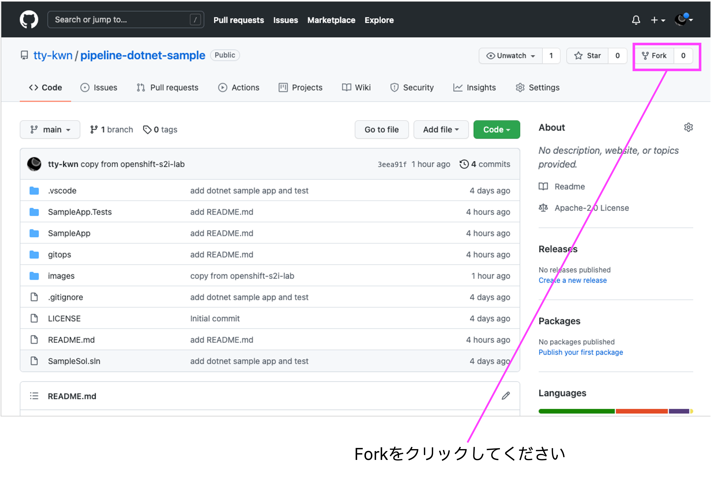
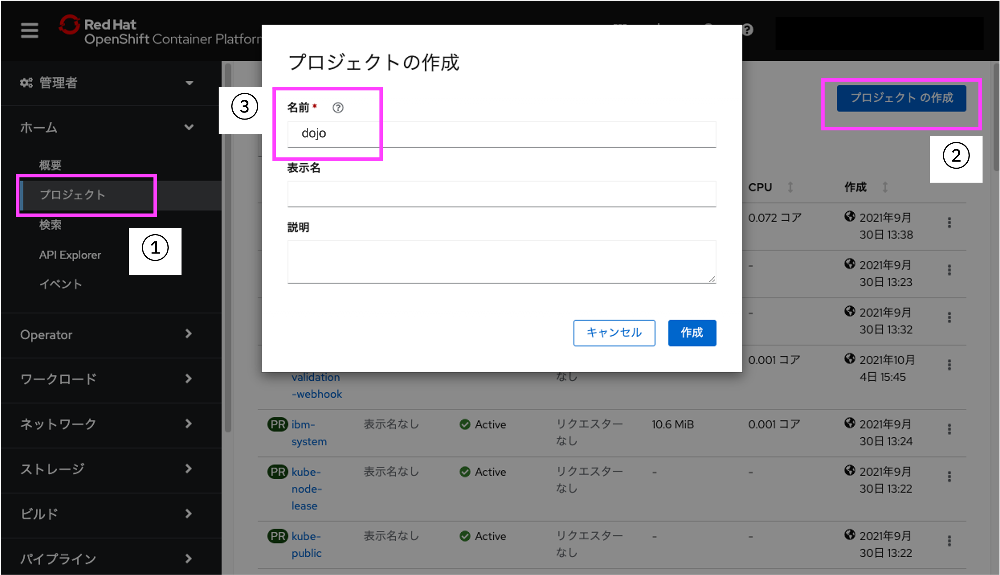
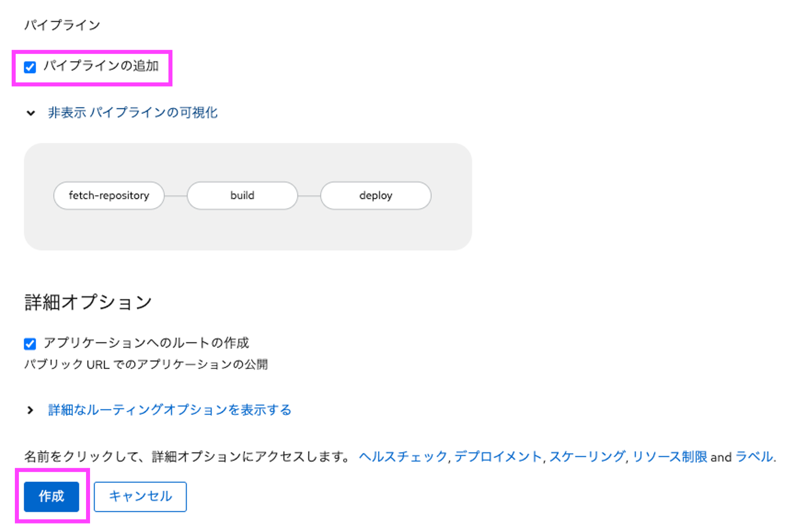
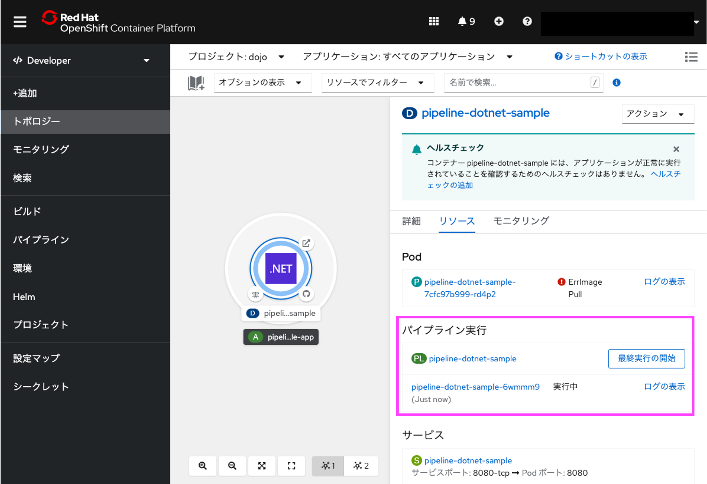
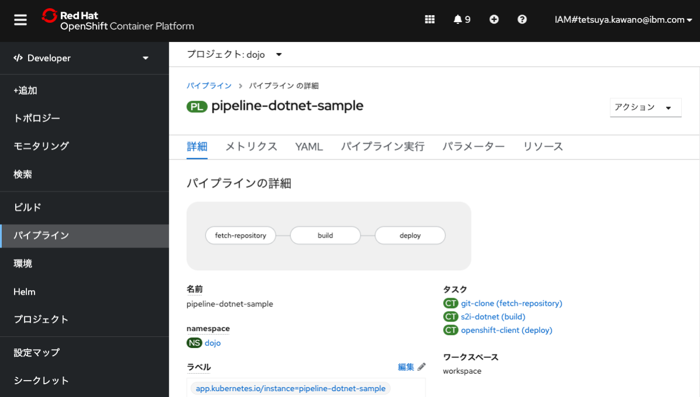

# OpenShift 初めてのPipeline ハンズオン その1

## 1. ワークショップの準備

下記ページの内容に沿って、ハンズオンワークショップの準備を実施ください。

[ハンズオンワークショップ - 準備](https://github.com/IBMDeveloperTokyo/openshift-s2i-lab/blob/main/PREPARE.md)

IBM CloudライトアカウントおよびGitHubアカウントの作成、OpenShiftクラスタの表示ができれば準備は完了です。

## 2. ソースコードのFork

ここからはGitHubへアクセスして自分のリポジトリへサンプルソースコードをForkしていきます。

### 2.1 GitHubへのサインイン

GitHubにサインイン(Sign in)してください。まだアカウント登録されていない方は[こちら](https://github.com/)からサインアップ(Sign up)してください。 

### 2.2 リポジトリーのFork

ブラウザーで[https://github.com/tty-kwn/pipeline-dotnet-sample](https://github.com/tty-kwn/pipeline-dotnet-sample)を開いてください。 
[Fork]ボタンをクリックして、自分のアカウントを選択してください。

### 2.3 自分のリポジトリーの確認

Forkする際に指定した自分のリポジトリーへ、対象のプロジェクトがForkされたことを確認します。 
リポジトリーのパスの最初の部分が自分のGitHubアカウントになっていればOKです。

## 3. Red Hat OpenShift Pipelinesのインストール

ここからは、OpenShiftにOpenShift Pipelinesをインストールします。

### 3.1 Operatorの検索

OpenShiftのWebコンソールへ戻り、[OperatorHub]ボタンをクリックします。

インストール可能なOperatorがタイル表示されています。

[Filter by keyword..]に「OpenShift Pipelines」と入力し、Red Hat OpenShift Pipelinesを選択します。

### 3.2 Operatorのインストール

Red Hat OpenShift Pipelines 画面にて[インストール]をクリックします。

続けて Operatorのインストール 画面にて、すべてデフォルトのままで、[インストール]をクリックします。

インストール完了のダイアログが表示されたあと、1分程度待つと画面左側メニューに[パイプライン]という項目が追加されます。

もししばらく待っても追加されない場合は画面のリロードを試してください。

以上でインストール作業は完了です。

## 4. Pipelineの作成

ここからは、OpenShiftへ自分のGitHubリポジトリーにあるアプリケーションソースコードを取得、ビルド、デプロイするpipelineを作成し、動作を確認します。

### 4.1 OpenShift Projectの作成

OpenShiftのWebコンソールへ戻り、[プロジェクト]ボタンをクリックします。

その後[プロジェクトの作成]ボタンをクリックすると プロジェクトの作成 画面が開きますので、任意のプロジェクト名を入力し[作成]ボタンをクリックしてください。

なお、名前にはすべて小文字をお使いください。

### 4.2 OpenShiftユーザータイプの切り替え

左上のメニューにて、[管理者]から[Developer]に切り替えます。

切り替えたら[+追加]をクリック、[ソース:Git]をクリックしてください。

### 4.3 デプロイするアプリケーションのソースコードを指定
自分のGitHubリポジトリーのURLを[GitリポジトリーURL]に入力します。

下の[詳細のGitオプションの表示]をクリックすると入力エリアが展開されます。

今回デプロイする対象のアプリケーションは[GitHubリポジトリー](https://github.com/tty-kwn/pipeline-dotnet-sample)の「main」ブランチ及び「SampleApp」ディレクトリ配下のため、以下の通り入力します。

| 項目 | 入力値 | 説明 |
| ---- | ---- | ---- |
| [Gitリファレンス] | main | ブランチ名 |
| [コンテキストディレクトリー] | /SampleApp | アプリケーションディレクトリ |

### 4.4 デプロイするアプリケーションのタイプを選択

言語やタイプの一覧がタイルで表示され、.NETが選択されていることを確認します。今回GitHubリポジトリーへForkしたプロジェクトは .Net Core アプリケーションだからです。

### 4.5 パイプラインの追加

[パイプラインの追加]をチェックします。これにより、ビルドとデプロイをOpenShift Pipelineを用いて行うようにできます。

チェックしたら最下段の[作成]ボタンをクリックしてください。（他のオプションはすべてデフォルトで構いません)

### 4.6 アプリケーションのデプロイ

アプリケーションのデプロイが始まります。最初はかなり時間がかかるため、デプロイが完了するまで10分程度お待ちいただく必要があります。

その間に、自動生成されたパイプラインを確認します。

これまでの作業で、パイプラインが自動生成されています。[パイプライン実行]の下の PL というアイコンの横のリンクをクリックします。

### 4.8 自動生成されたパイプラインの確認

自動生成されたパイプラインを確認していきます。

パイプラインは以下の3つのタスクで構成されています。

| タスク名 | クラスタータスク | 説明 |
| ---- | ---- | ---- |
| fetch-repository | git-clone | gitからソースコードを取得(クローン)します |
| build | s2i-dotnet | S2Iビルドを実施し、生成されたコンテナイメージをレジストリへ保存します |
| deploy | openshift-client | ocコマンドを利用して、ビルドしたアプリ(コンテナイメージ)をOpenShiftにデプロイします |

※ クラスタータスクとは、OpenShiftが準備済みのタスクのことです。

関係性を図示すると、以下のように描くことができます。

各タスクの処理内容については、それぞれのYAMLを参照してください。

### 4.9 アプリケーションへのアクセス
アプリケーションの動作確認に戻ります。[トポロジ]を選択し、先程デプロイしたアプリの状況を確認します。

中の丸が濃紺になったら完成です。

丸の中をクリックすると右側にメニューが出てきます。[Routes]の下のURLをクリックするとWebへ公開されたアプリケーションへアクセスできます。

デプロイされ、Webへ公開されたアプリケーションへアクセスすることができました。

まずはパイプラインを使ってソースコードの取得、アプリケーションのビルド、OpenShiftでのデプロイを実行することができました。

ハンズオン その1は以上で終了です。
