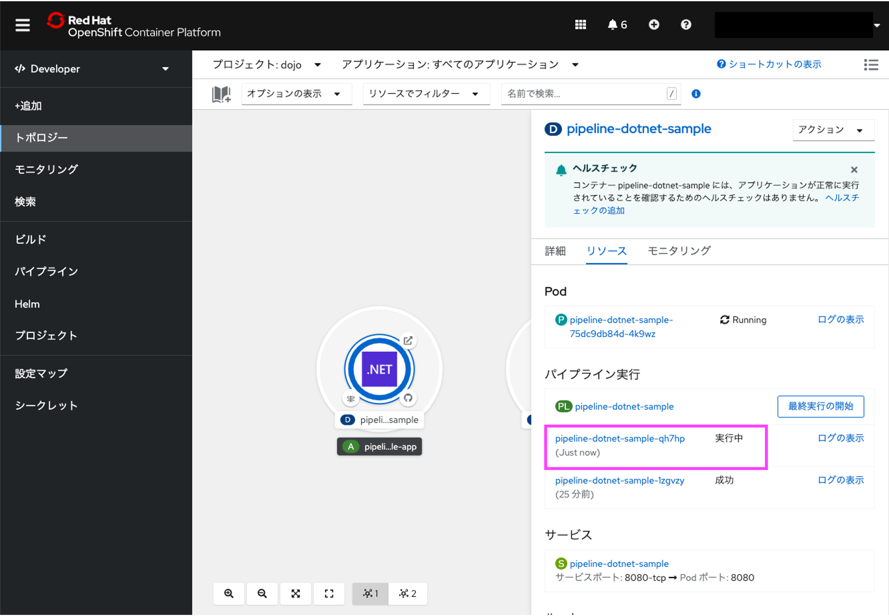

# OpenShift 初めてのPipeline/GitOps ハンズオン その2

## 1. トリガーの設定と動作確認

続けて、トリガーをセットし、GitHubへのpushをトリガとしてパイプラインが動作することを確認します。

### 1.1 トリガーの追加

[パイプライン実行]の下の PL というアイコンの横のリンクをクリックします。


パイプラインが表示されます。
右上の[アクション]をクリックし、[トリガーの追加] をクリックします。


トリガーの追加 画面が開きますので、[Gitプロバイダータイプ]に github-push を選択し、[追加]ボタンをクリックしてください。


パイプラインにトリガーが追加されました。

このトリガーは、GitHub WebHookからのHTTPリクエストを受けパイプラインを実行します。そのために、GitHub WebHookに設定が必要です。

そのために、[トリガーテンプレート]の下のURLをクリップボードにコピーします。


### 1.2 GitHubにWebhookを設定

GitHubの自分のリポジトリーへ戻り、[Settings] -> [Webhooks] -> [Add webhook]を選択します。


先ほどクリップボードにコピーしたURLを[Payload URL]に貼り付けてください。[Control type]は[application/json]を選択してください。


入力後、[Add webhook]を選択します。<br>
以下の図の様に緑のチェックマークが付いたら設定成功です。（チェックマークが表示されない場合はページを再読み込みしてください。）


これでwebhookの設定は完了です。後はソースコードの修正で自動的にアプリケーションがデプロイされます。

### 1.3 ソースコードの修正とパイプラインが自動実行されることの確認

GitHub上のソースコードを修正し、それが自動でOpenShiftへ反映されることを試していきます。

GitHubの自分のリポジトリ画面から[SampleApp/Pages/Index.cshtml]ファイルを選択します。


ペンのアイコンをクリックして編集モードにします。<br>
ここでは、GitHubのGUIから編集を行いますが、ローカルにcloneして編集したファイルをcommit、pushしてもOKです。


変更点をクイックに確認するために、ここでは10行目に以下の1行を挿入します。

```<p>トリガー動作テスト</p>```

変更したら[Commit changes]をクリックしてください。自分所有のリポジトリーなので、そのまま反映されます。


OpenShiftのWebコンソールへ戻り、左側の[トポロジー]を確認すると、再度パイプラインが実行されていることが分かります。


パイプライン実行が完了したらアプリケーションを起動し直してください。（既に表示されている場合はリロードしてください）<br>
アプリケーション内に トリガー動作テスト という文言が追加されていることが確認できました。



これで、OpenShift Pipelineの基本的な動作確認は完了です。

## 2. テストタスクの作成及びパイプライン実行

続けて、作成したパイプラインにテストタスクを導入し、テストの失敗/成功時のパイプラインの動作を確認していきます。

### 2.1 テストタスクの作成

テストタスクを追加します。

.Net CoreのアプリケーションはSampleApp.Testsに記載しており、```dotnet test``` コマンドによりテストを実行することができます。

左上のメニューにて、[Developer]から[管理者]に切り替えます。

[タスク]をクリックし画面左上の[作成]をクリックし、[タスク]をクリックします。


GitHubの自分のリポジトリーを開き、
GitHubの自分のリポジトリ画面から[task/dotnet-test.yml]ファイルを選択し、[Raw]をクリックします。


ブラウザ上に表示されているテキストをすべてクリップボードにコピーします。


OpenShiftの画面に戻ります。クリップボードにコピーしたテキストを、画面に貼り付けて[作成]をクリックします。

このテストタスクは、[git-clone (fetch-repository)]タスクによってワークスペースに置かれたソースコードを使ってアプリケーションのテストを実行します。


### 2.2 テストタスクのパイプラインへの追加

では、テストタスクをパイプラインに追加します。

[パイプライン]を選択し、画面中央の PL アイコンの隣のリンクをクリックします。


画面右上の[アクション]から[パイプラインの編集]をクリックします。


タスク上の(build)にマウスカーソルを当てると、[+]が左右と下に表示されます。左側の[+]をクリックします。


dotnet-testを選択します。続けて、追加した(dotnet-test)をクリックします。

dotnet-testタスクのパラメータ設定が表示されます。以下の通り設定します。
| パラメータ | 値 |
| --- | --- |
| VERSION | $(params.VERSION) |
| PATH_CONTEXT | $(params.PATH_CONTEXT) |

ワークスペースは workspace を選択し、[保存]をクリックします。


### 2.3 パイプラインの動作確認(テスト失敗)

では、変更したパイプラインの動作を確認します。
[最終実行の開始]をクリックします。
テストが失敗したことを確認できました。

このテストはわざと失敗するようにしています。
テストが失敗したことにより、パイプラインが失敗となり後続のビルドやデプロイ処理が行われていないことを確認できました。

では、続けてソースコードを修正し、テストが通るようにします。

## 7. テストソースの修正及びパイプライン自動実行
### 7.1 アプリケーションの修正とpush
### 7.2 パイプラインの動作確認(テスト成功)
