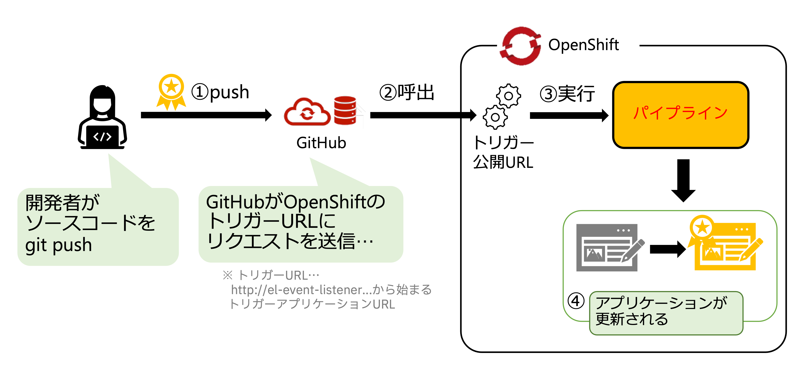
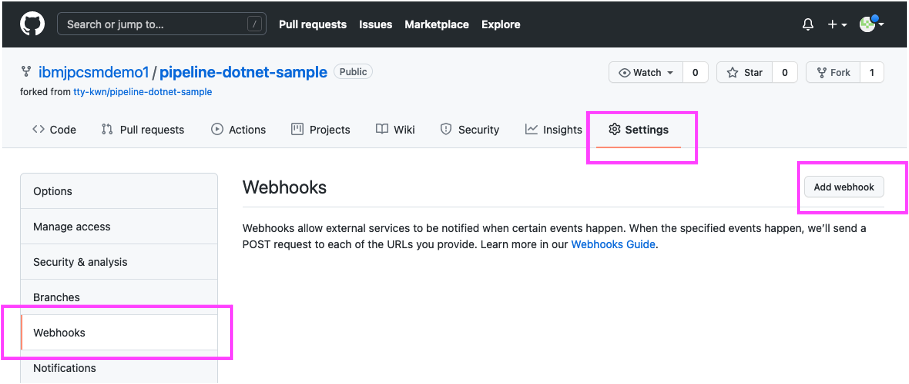
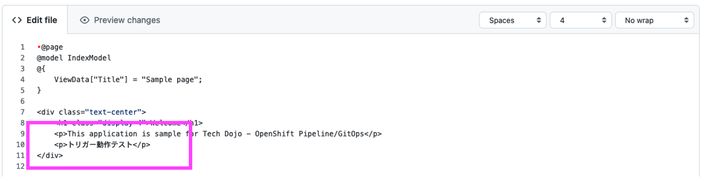
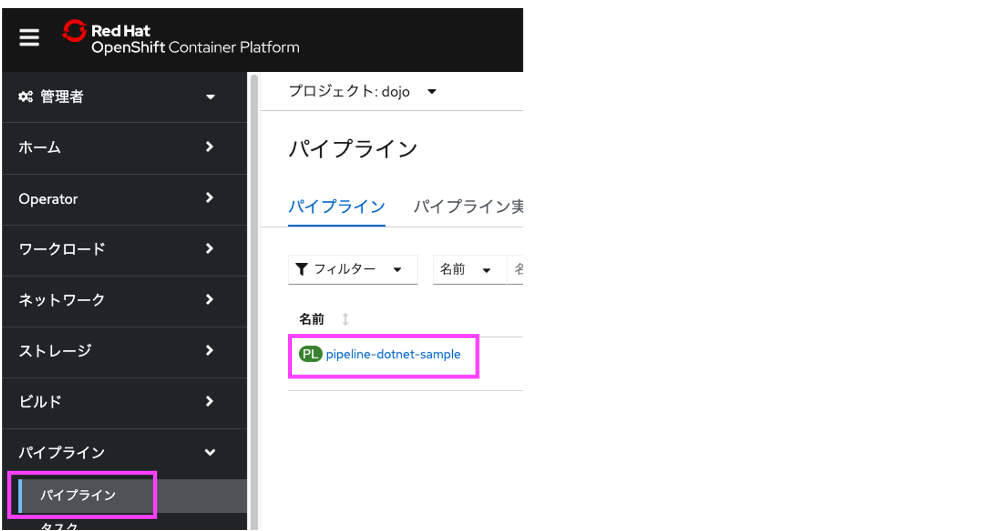
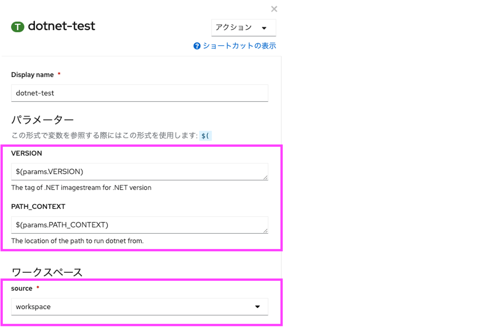

# OpenShift 初めてのPipeline ハンズオン その2

[ハンズオン その1](./handson1.md) では、GitHubからソースコードを取得し、ビルド、デプロイまでをパイプラインを使って構築しました。
ハンズオン その2では、GitHubとの連携及びテストタスクを導入します。

## 1. トリガーの設定と動作確認

続けて、トリガーをセットし、GitHubへのpushをトリガとしてパイプラインが自動的に動作することを確認します。

### 1.1 トリガーの追加

[トポロジー]画面を開いている方は、[パイプライン実行]の下の PL というアイコンの横のリンクをクリックします。

※ もしページを閉じてしまっている場合、最初から操作する場合は以下の手順となります。

  1. OpenShiftのWebコンソールを表示
  2. 左上のメニューにて[管理者]から[Developer]に切り替え
  3. [トポロジー]画面をクリックすると、画面に表示された丸の中をクリックすると右側にメニューが出てきます。
  4. そのメニュー中央辺りの[パイプライン実行]の下の PL というアイコンの横のリンクをクリックします。


パイプラインが表示されます。
右上の[アクション]をクリックし、[トリガーの追加] をクリックします。


トリガーの追加 画面が開きますので、[Gitプロバイダータイプ]に github-push を選択し、[追加]ボタンをクリックしてください。

他の項目はデフォルト値のままで構いません。


パイプラインにトリガーが追加されました。

このトリガーは、GitHub WebHookからのHTTPリクエストを受けパイプラインを実行します。そのために、GitHub WebHookに設定が必要です。

そのために、[トリガーテンプレート]の下のURLをクリップボードにコピーします。


GitHubとトリガーURLとの関係は以下の通りです。続けて、クリップボードにコピーしたURLをGitHubに登録します。



### 1.2 GitHubにWebhookを設定

GitHubの自分のリポジトリーへ戻り、[Settings] -> [Webhooks] -> [Add webhook]を選択します。



先ほどクリップボードにコピーしたトリガーURLを[Payload URL]に貼り付けてください。[Control type]は[application/json]を選択してください。


入力後、[Add webhook]を選択します。<br>
以下の図の様に緑のチェックマークが付いたら設定成功です。<br>
すぐにチェックマークが表示されないので、ページを再読み込みしてください。


これでwebhookの設定は完了です。後はソースコードの修正で自動的にアプリケーションがデプロイされます。

### 1.3 ソースコードの修正とパイプラインが自動実行されることの確認

GitHub上のソースコードを修正し、それが自動でOpenShiftへ反映されることを試していきます。

GitHubの自分のリポジトリ画面から[SampleApp/Pages/Index.cshtml]ファイルを選択します。


ペンのアイコンをクリックして編集モードにします。<br>
ここでは、GitHubのGUIから編集を行いますが、ローカルにcloneして編集したファイルをcommit、pushしてもOKです。



変更点をクイックに確認するために、ここでは10行目に以下の1行を挿入します。

```<p>トリガー動作テスト</p>```

変更したら[Commit changes]をクリックしてください。自分所有のリポジトリーなので、そのまま反映されます。


OpenShiftのWebコンソールへ戻り、左側の[トポロジー]を確認すると、再度パイプラインが実行されていることが分かります。


パイプライン実行が完了したらアプリケーションを表示してください。（既に表示されている場合はリロードしてください）<br>
アプリケーション内に先程追加した文言 (トリガー動作テスト) が追加されていることが確認できました。


これで、トリガーを用いて、OpenShift PipelineとGitHubを連携することができました。<br>
これにより、GitHubへのpushを皮切りとしてアプリデプロイまで自動的に実施される、CI/CDの基本設定が完了しました。

## 2. テストタスクの作成及びパイプライン実行

続けて、作成したパイプラインにテストタスクを導入し、テストの失敗/成功時のパイプラインの動作を確認していきます。

### 2.1 .Netにおけるテスト

テストタスクを追加します。

このハンズオンで利用しているアプリケーションは .Net で構築されています。

.Net アプリケーションは```SampleApp```に、テストコードは```SampleApp.Tests```に記載しています。

注) .Netのテストコードの書き方については、Microsoftの以下のサイトを参照ください。
<https://docs.microsoft.com/ja-jp/dotnet/core/testing/unit-testing-with-dotnet-test>

.Netは、現在はWindows/Mac/Linuxと様々な環境で```dotnet```というコマンドを使って様々な処理を行うことができます。

テストは、```dotnet test```とタイプすることにより、実行可能です。今回はこのコマンドを使ってテストタスクを作成します。

### 2.2 テストタスクの作成

GitHubの自分のリポジトリーを開き、GitHubの自分のリポジトリ画面から[tasks/dotnet-test.yml](./tasks/donet-test.yml)ファイルを選択し、[Raw]をクリックします。

ブラウザ上に表示されているテキストをすべてクリップボードにコピーします。


OpenShiftの画面に戻ります。左上のメニューにて、[Developer]から[管理者]に切り替えます。

[タスク]をクリックし画面左上の[作成]をクリックし、[タスク]をクリックします。


クリップボードにコピーしたテキストを、画面に貼り付けて[作成]をクリックします。


これでテストタスクが作成されました。次はこのテストタスクをパイプラインに組み込みます。

### 2.3 テストタスクのパイプラインへの追加

では、テストタスクをパイプラインに追加します。

左上のメニューにて、[管理者]から[Developer]に切り替えます。

[パイプライン]を選択し、画面中央の PL アイコンの隣のリンクをクリックします。



画面右上の[アクション]から[パイプラインの編集]をクリックします。


このテストタスクは、[fetch-repository (git-clone))]タスクによってワークスペースに置かれたソースコードを使ってアプリケーションのテストを実行します。

[build (s2i-dotnet)]はコンテナイメージの生成まで実施してしまいますので、その間に配置します。

タスク上の(build)にマウスカーソルを当てると、[+]が左右と下に表示されます。左側の[+]をクリックします。


dotnet-testを選択します。


続けて、追加した(dotnet-test)をクリックします。

dotnet-testタスクのパラメータ設定が表示されます。以下の通り設定します。
| パラメータ | 値 |
| --- | --- |
| VERSION | $(params.VERSION) |
| PATH_CONTEXT | $(params.PATH_CONTEXT) |

ワークスペースは workspace を選択し、[保存]をクリックします。



[dotnet-test]タスクに赤い[!]が表示が表示されていないことを確認し、[保存]をクリックします。


以上で、テストタスクをパイプラインへ追加することができました。

### 2.4 パイプラインの動作確認(テスト失敗)

では、変更したパイプラインの動作を確認します。
画面右上の[アクション]から[最終実行の開始]をクリックします。


テストが失敗したはずです。

実は、このテストはわざと失敗するようにしています。

テストが失敗したことで、パイプライン後続のビルドやデプロイ処理が行われていないことを確認できました。


失敗した[dotnet-test]タスクをクリックすると、その失敗内容をログを通じて確認することができます。

今回は、1件Failedとなっており、```Assert.Contains() Failure```, ```Not found: Success```とあります。

このテストでは、「Success」という文字列がWebサイトに含まれていることを期待したが、含まれていなかったことを示唆しています。


## 3. テストソースの修正及びパイプライン自動実行

それでは、ソースコードに「Success」を含むように修正を行い、テストが通るようにします。

### 3.1 ソースコードの修正

GitHubの自分のリポジトリ画面に移動し、[SampleApp/Pages/Index.cshtml](./SampleApp/Pages/Index.cshtml)ファイルを選択します。


ペンのアイコンをクリックして編集モードにします。

ここでは、GitHubのGUIから編集を行いますが、ローカルにcloneして編集したファイルをcommit、pushしてもOKです。


変更点をクイックに確認するために、ここでは11行目に以下の1行を挿入します。

```<p>Test Success!</p>```

変更したら[Commit changes]をクリックしてください。自分所有のリポジトリーなので、そのまま反映されます。


### 3.2 パイプラインの動作確認(テスト成功)

OpenShiftのWebコンソールへ戻り、左側の[トポロジー]を確認すると、再度パイプラインが実行されていることが分かります。


2,3分程度で[dotnet-test]が完了し[build]に移行しているはずです。

実行中のパイプライン実行の右にある[ログの表示]リンクをクリックすることで、パイプライン実行結果ログを確認することができます。

前回は1件Failedとなっていましたが、今回は1件Passed、つまりテスト成功となっています。

これにより後続のタスクが継続実行されていることを確認できました。


もうしばらく待つと、deployまで終了し画面中心辺りに(成功)という小さなラベルが表示されていることを確認できます。

また、deployのログを見ると```successfully rolled out```とありますので、デプロイも成功したことを確認できました。


では、アプリケーションを表示してみてください。（既に表示されている場合はリロードしてください）<br>
アプリケーション内に先程追加した文言 (Test Sucess!) が追加されていることが確認できました。


これで、パイプラインにテストタスクを追加し、CIにテストを追加することができました。

[ハンズオン その3](./handson3.md)へ→