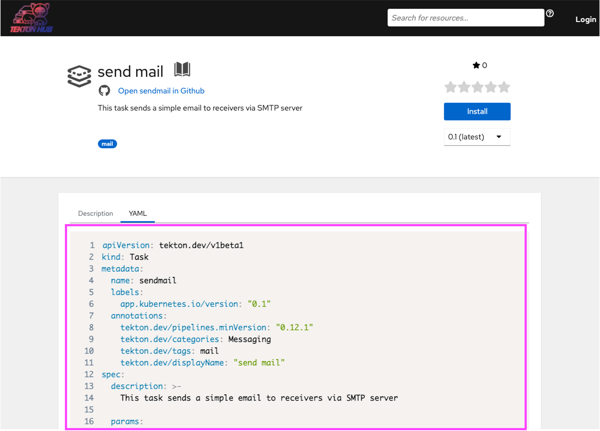
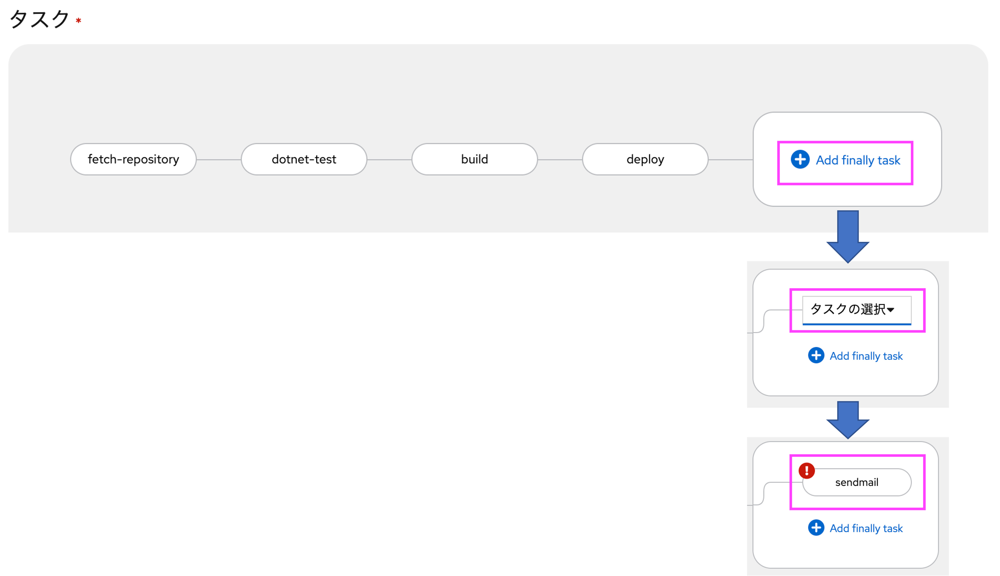

# OpenShift 初めてのPipeline ハンズオン その3

OpenShift Pipelineではなく OpenShift GitOpsについて、ごく簡単にご説明します。

## 1. Red Hat OpenShift Pipelinesのインストール

ここからは、OpenShiftにOpenShift GitOpsをインストールします。

### 1.1 Operatorの検索

OpenShiftのWebコンソールへ戻り、[OperatorHub]ボタンをクリックします。

インストール可能なOperatorがタイル表示されています。

[Filter by keyword..]に「OpenShift GitOps」と入力し、Red Hat OpenShift GitOpsを選択します。

### 1.2 Operatorのインストール

Red Hat OpenShift Pipelines 画面にて[インストール]をクリックします。

続けて Operatorのインストール 画面にて、すべてデフォルトのままで、[インストール]をクリックします。

インストール完了のダイアログが表示されたあと、左上のメニューにて、[管理者]から[Developer]に切り替えます。

画面左側の項目に「環境」というメニューが追加されていれば成功です。

もししばらく待っても追加されない場合は画面のリロードを試してください。

以上でインストール作業は完了です。

## 2. GitOps(ArgoCD)　ログイン

インストールしたGitOps(ArgoCD)を表示してみます。

### 2.1 ArgoCDログイン情報の取得

左上のメニューが[管理者]になっている方は、[管理者]から[Developer]に切り替えます。

左下の[シークレット]をクリックし、中央上の[プロジェクト]を openshift-gitops に変更します。

(s) openshift-gitops-operator という項目リンクをクリックします。

最下部にGitOps(ArgoCD)のadminユーザのパスワードが表示されています。

右下のコピーボタンをクリックし、admin.password値をクリップボードにコピーします。

### 2.2 ArgoCDの起動

画面右上の四角いアイコンをクリックし、[Cluster ArgoCD]をクリックします。

ArgoCDの画面が表示されます。ユーザ名にadmin、パスワードは先ほどクリップボードコピーした値を貼り付けます。
[SIGN IN]をクリックします。

ArgoCDの画面を表示することができました。

ログイン作業は以上です。

## 2. ArgoCDへのアプリ設定とデプロイ実行
