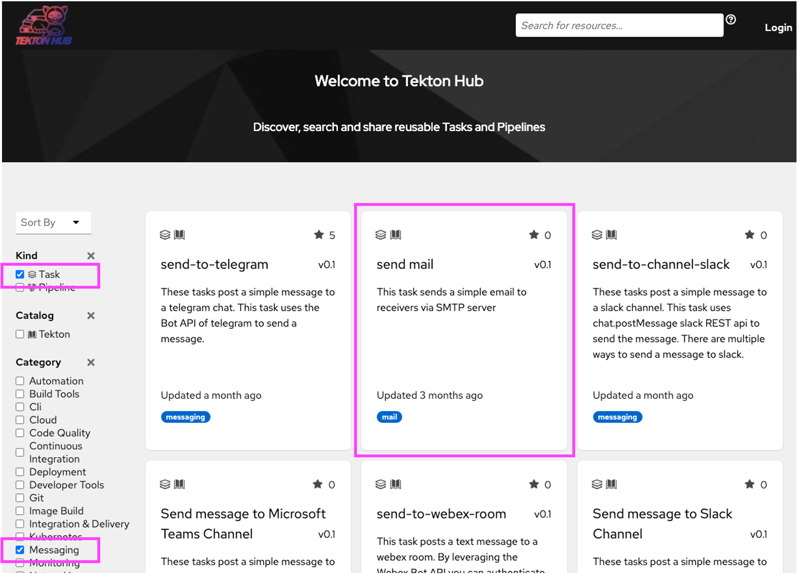
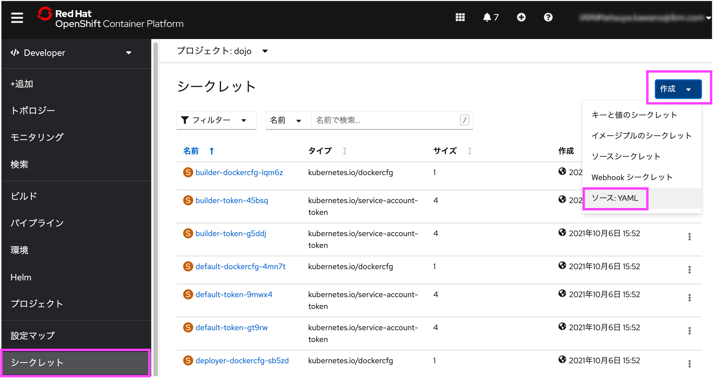
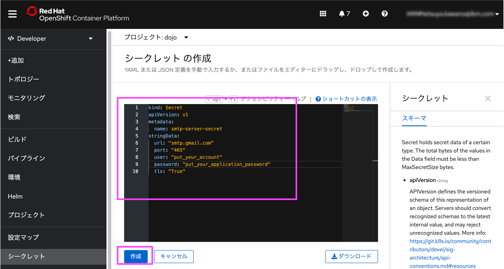

# OpenShift 初めてのPipeline ハンズオン その3

[ハンズオン その2](./handson2.md) では、GitHubへのpushと連動するためのトリガ設定、及びテストタスクを導入しました。

ハンズオン その3では、パイプラインの終了時にパイプライン実行結果をメール送信するタスクを追加します。

**なお、このハンズオンではSMTPサーバとしてGmailを利用しています。Gmailアカウントをお持ちでない、もしくは利用が躊躇われる環境の方は、適宜利用可能なSMTPサーバ等を使ってご試行いただければと存じます。**

## 1. Tekton Hubの紹介とメール送信タスクの導入

### 1.1 Tekton Hub

OpenShift Pipelineのベースである Tekton は、[Tekton Hub](https://hub.tekton.dev)というサイトを配信しています。

このサイトでは、皆さんが必要とするようなタスクが多く公開されています。


もしクラスタータスクに必要なタスクが無く、新たにタスクを作成しなければならない場合は、まずこのサイトでタスクがないか探してみてください。

今回はメール送信タスクを導入します。

### 1.2 メール送信タスクの検索

画面左側の [Task] と [Messaging] の2つをクリックします。

画面中央に表示された [send mail] をクリックします。



> ※ 本ハンズオンでは扱いませんが、[Send message to Slack Channel] や [Send message to Microsoft Teams Channel] など、メール送信以外の通知タスクも公開されています。

### 1.3 メール送信タスクのインストール

send mailの説明画面が表示されます。

> 本章は、以下のコマンドで代替ができます。
>
> ```oc apply -f https://raw.githubusercontent.com/tektoncd/catalog/main/task/sendmail/0.1/sendmail.yaml```
>
> もし oc コマンドの利用方法を理解されている方は、こちらもお試しください。

画面中央付近の[YAML]タブをクリックすると、タスクを定義するYAMLが表示されるので、これをすべてクリップボードにコピーしておきます。


OpenShiftの画面に戻ります。左上のメニューにて、[Developer]から[管理者]に切り替えます。

[タスク]をクリックし画面左上の[作成]をクリックし、[タスク]をクリックします。


タスクの作成画面にて、先ほどクリップボードにコピーしたYAMLを貼り付け、[作成]ボタンをクリックします。


以上で、メール送信タスクが作成されました。

## 2. gmail送信設定と動作確認

続けて、gmailによるメール設定を行います。

gmailでは、SMTPサーバを指定してメールの送信が可能です。

ただし、認証を厳しくしているため、デフォルトの状態のままでは利用できません。

今回は、2段階認証を有効にしアプリパスワードを発行する手順をご紹介します。

### 2.1 2段階認証/アプリパスワードの有効化

gmailでアプリパスワードを有効にします。

このアプリパスワードを使って、tektonからgmailのsmtpサーバにログインしメールを送信します。

アプリパスワードを有効にするためには、まずは2段階認証を有効にする必要があります。

下記の内容を確認しながら、設定を行ってください。

https://support.google.com/accounts/answer/185839

続けて、アプリパスワードを有効にします。

https://support.google.com/mail/answer/185833?hl=ja

16字の文字列が取得できれば、成功です。

取得したアプリパスワードは、決して無くさないようにテキストファイル等に貼り付けておいてください。

## 3. シークレットの作成

### 3.1 YAMLの準備

では、メール送信のためのsmtpサーバ接続情報を格納する、シークレットを作成していきます。

シークレットのYAMLは以下です。

```yaml
kind: Secret
apiVersion: v1
metadata:
  name: smtp-server-secret
stringData:
  url: "smtp.gmail.com"
  port: "465"
  user: "gmailアカウント"
  password: "先ほど取得したアプリパスワード"
  tls: "True"
```

```gmailアカウント``` と ```先ほど取得したアプリパスワード``` を、それぞれ皆さんのアカウント及び先ほど取得したアプリパスワードで置き換えてください。

### 3.2 シークレットの作成

OpenShiftの画面に戻ります。左上のメニューにて、[管理者]から[Developer]に切り替えます。

[シークレット]をクリックし画面左上の[作成]をクリックし、[ソース：YAML]をクリックします。



シークレットの作成画面にて、先ほど作成したYAMLを貼り付け、[作成]ボタンをクリックします。



以上で、シークレットが作成されました。

## 4. パイプラインへの組み込みと動作確認

### 4.1 パイプラインの変更

[パイプライン]をクリックし、作成したパイプライン(PL)pipeline-dotnet-sample リンクをクリックします。


画面左上 [アクション] をクリックし、[パイプラインの編集] をクリックします。


パイプラインを以下の順に編集します。

1. [(+)Add finally task]をクリック
1. [タスクの選択]をクリック
1. [(T)sendmail] を選択


[sendmail]タスクをクリックします。


以下のパラメータを入力します。

| 項目名| 値 | 説明|
| --- | --- | --- |
| server | smtp-server-secret | SMTPサーバ情報、先ほど作成したシークレット名を指定 |
| subject | OpenShift Pipeline Result: $(context.pipeline.name) | メールタイトル。今回はパイプライン名を含めました |
| body | 下記参照 | tekton が提供する変数をすべて出力する内容としました |
| sender | gmailメールアドレス | 皆さんが利用するgmailメールアドレス |
| recipients | gmailメールアドレス | 皆さんが利用するgmailメールアドレス |

body は 以下としました。

```text
Pipeline Name: $(context.pipeline.name)
PipelineRun Name: $(context.pipelineRun.name)

Workspace.Bound: $(workspaces.workspace.bound)

Task Results:
  Fetch Repository: $(tasks.fetch-repository.status)
  Dotnet Test: $(tasks.dotnet-test.status)
  Build: $(tasks.build.status)
  Deploy: $(tasks.deploy.status)
```
タスクを確認し、[sendmail]に[!]マークが付いていないことを確認し、[保存]ボタンをクリックします。


以上でメール送信タスクの追加は完了です。

### 4.1 パイプラインの変更

続けて、パイプラインを実行し、メール送信タスクの動作を確認します。

画面右上の[アクション]をクリックし、[最終実行の開始]をクリックします。


[パイプライン実行]の画面に遷移しています。[ログ]をクリックすることで、実行しているパイプラインの各タスクの動作状況を確認することができます。


ログが[sendmail]まで進んだら、メーラーを表示しメールの送信を待ちます。

メールの受信を確認できれば、本作業は完了です。


各タスクの状況を把握できるメールが送信されているのが確認できましたでしょうか。

以上で、本ハンズオンは終了となります。
