# OpenShift 初めてのGitOps ハンズオン

OpenShift GitOpsについて、ごく簡単にご説明します。

## 1. Operatorのインストール

本ハンズオンに必要なOperatorをインストールします。

### 1.1 Red Hat OpenShift Pipelinesのインストール

ここからは、OpenShiftにOpenShift Pipelinesをインストールします。

#### 1.1.1 Operatorの検索

左上のメニューにて、[Developer]から[管理者]に切り替えます。

[OperatorHub]ボタンをクリックします。

インストール可能なOperatorがタイル表示されています。

[Filter by keyword..]に「OpenShift Pipelines」と入力し、Red Hat OpenShift Pipelinesを選択します。


#### 1.1.2 Operatorのインストール

Red Hat OpenShift Pipelines 画面にて[インストール]をクリックします。

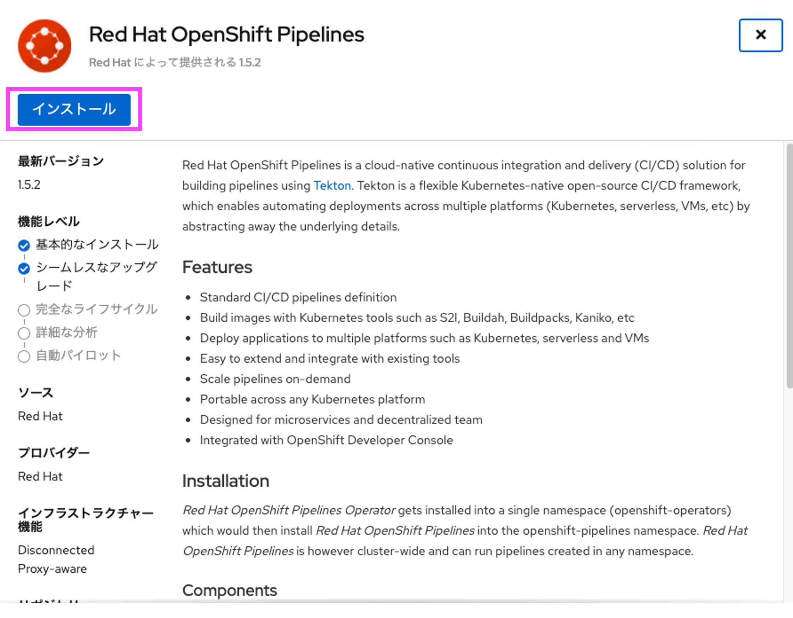

続けて Operatorのインストール 画面にて、すべてデフォルトのままで、[インストール]をクリックします。


インストール完了のダイアログが表示されたあと、1分程度待つと画面左側メニューに[パイプライン]という項目が追加されます。

もししばらく待っても追加されない場合は画面のリロードを試してください。


### 1.2 Red Hat OpenShift GitOpsのインストール

ここからは、OpenShiftにOpenShift GitOpsをインストールします。

#### 1.2.1 Operatorの検索

[OperatorHub]ボタンをクリックします。

インストール可能なOperatorがタイル表示されています。

[Filter by keyword..]に「OpenShift GitOps」と入力し、Red Hat OpenShift GitOpsを選択します。


#### 1.2.2 Operatorのインストール

Red Hat OpenShift GitOps 画面にて[インストール]をクリックします。


続けて Operatorのインストール 画面にて、すべてデフォルトのままで、[インストール]をクリックします。


インストール完了のダイアログが表示されたあと、左上のメニューにて、[管理者]から[Developer]に切り替えます。

画面左側の項目に「環境」というメニューが追加されていれば成功です。


もししばらく待っても追加されない場合は画面のリロードを試してください。

以上でインストール作業は完了です。

## 2. GitOps(ArgoCD)　ログイン

インストールしたGitOps(ArgoCD)を表示してみます。

### 2.1 ArgoCDログイン情報の取得

左上のメニューが[管理者]になっている方は、[管理者]から[Developer]に切り替えます。

左下の[シークレット]をクリックし、中央上の[プロジェクト]を openshift-gitops に変更します。

(s) openshift-gitops-cluster という項目リンクをクリックします。


最下部にGitOps(ArgoCD)のadminユーザのパスワードが表示されています。

右下のコピーボタンをクリックし、admin.password値をクリップボードにコピーします。


### 2.2 ArgoCDの起動

画面右上の四角いアイコンをクリックし、[Cluster ArgoCD]をクリックします。


ArgoCDの画面が表示されます。ユーザ名にadmin、パスワードは先ほどクリップボードコピーした値を貼り付けます。
[SIGN IN]をクリックします。


ArgoCDの画面を表示することができました。


ログイン作業は以上です。

## 3. 開発環境用アプリケーションのデプロイ

### 3.1 ソースコードのFork

GitHubにサインイン(Sign in)してください。まだアカウント登録されていない方は[こちら](https://github.com/)からサインアップ(Sign up)してください。


ブラウザーで[https://github.com/IBMDeveloperTokyo/cicd-dotnet-sample](https://github.com/IBMDeveloperTokyo/cicd-dotnet-sample)を開いてください。

[Fork]ボタンをクリックして、自分のアカウントを選択してください。


Forkする際に指定した自分のリポジトリーへ、対象のプロジェクトがForkされたことを確認します。
リポジトリーのパスの最初の部分が自分のGitHubアカウントになっていればOKです。


Forkができたら、featureブランチ「feature_dojo」を作成します。


### 3.2 開発環境の作成

OpenShiftのWebコンソールへ戻り、[Developer]から[管理者]に切り替えてプロジェクトを作成します。


[管理者]から[Developer]に切り替えて、[+追加]をクリック、[ソース:Git]をクリックしてください。


自分のGitHubリポジトリーのURLを[GitリポジトリーURL]に入力します。

下の[詳細のGitオプションの表示]をクリックすると入力エリアが展開されます。

今回デプロイする対象のアプリケーションは GitHubリポジトリー の「feature_dojo」ブランチ及び「SampleApp」ディレクトリ配下のため、以下の通り入力します。

| 項目 | 入力値 | 説明 |
| ---- | ---- | ---- |
| [Gitリファレンス] | feature_dojo | ブランチ名 |
| [コンテキストディレクトリー] | /SampleApp | アプリケーションディレクトリ |

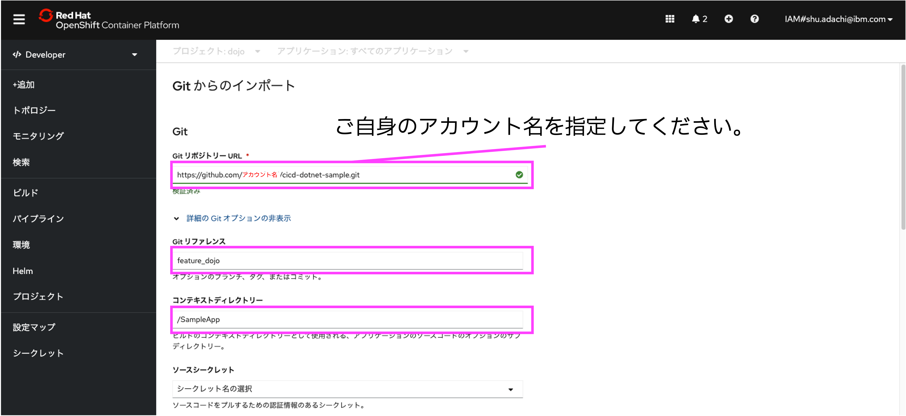

言語やタイプの一覧がタイルで表示され、.NETが選択されていることを確認します。


[パイプラインの追加]をチェックします。これにより、ビルドとデプロイをOpenShift Pipelineを用いて行うようにできます。

チェックしたら最下段の[作成]ボタンをクリックしてください。（他のオプションはすべてデフォルトで構いません)


デプロイが始まったら、開発環境の準備は完了です。

### 3.3 本番環境の作成

開発環境に作成されたパイプラインをベースに、本番環境用のパイプラインを作成します。

#### 3.3.1 パイプラインで使用する永続ボリュームの作成

[Developer]から[管理者]に切り替えて、[ストレージ]の中から[永続ボリューム要求]を選択し、[永続ボリューム要求の作成]をクリックします。


本番用のパイプラインで使用する永続ボリュームを作成します。
以下の通り入力し、[作成]をクリックします。
|項目|入力値|備考|
|--|--|--|
|永続ボリューム要求の名前|dojo||
|サイズ|1|20以下の数値を指定した場合、自動で20GiBのボリュームが作成されます。|


#### 3.3.2 本番環境のパイプラインの作成

[管理者]から[Developer]に切り替えて、[パイプライン]をクリックし、**pipeline-dotnet-sample-git** のリンクをクリックします。


パイプラインの詳細が表示されたら、[YAML]タブをクリックし、表示されているYAMLを全てコピーして、左上のパンくずリストの **パイプライン** をクリックします。


[パイプラインの作成]をクリックします。
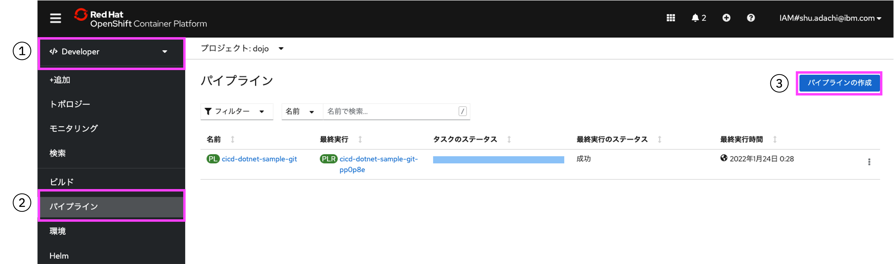

パイプラインビルダーが表示されたら、YAMLビューを選択し、先ほどコピーしたパイプラインのYAMLで上書きします。


開発用から本番用に書き換えるため、まずは不要なパラメータを削除します。
削除するパラメータは以下の5ヶ所です。
`metadata.creationTimestamp`
`metadate.generation`
`metadata.managedFields`
`metadata.resourceVersion`
`metadata.uid`
`spec.params.name` (deployの部分のみ)


削除が完了したら、本番環境用のパラメータに変更します。
`# コメント`がある部分を変更してください。

```yaml
・
・
・
metadata:
  labels:
    app.kubernetes.io/instance: pipeline-dotnet-sample # 末尾の'-git'を削除
    app.kubernetes.io/name: pipeline-dotnet-sample # 末尾の'-git'を削除
    pipeline.openshift.io/runtime: dotnet
    pipeline.openshift.io/runtime-version: 5.0-ubi8
    pipeline.openshift.io/type: kubernetes
  name: pipeline-dotnet-sample # 末尾の'-git'を削除
  namespace: dojo
spec:
  params:
    - default: pipeline-dotnet-sample # 末尾の'-git'を削除
      name: APP_NAME
      type: string
    - default: 'https://github.com/ご自身のGitHubアカウント/pipeline-dotnet-sample.git'
      name: GIT_REPO
      type: string
    - default: main # 'feature_dojo'を'main'に変更
      name: GIT_REVISION
      type: string
    - default: >-
        image-registry.openshift-image-registry.svc:5000/dojo/pipeline-dotnet-sample # 末尾の'-git'を削除
      name: IMAGE_NAME
      type: string
    - default: SampleApp
      name: PATH_CONTEXT
      type: string
    - default: 5.0-ubi8
      name: VERSION
      type: string
・
・
・
```

変更が完了したら、[作成]をクリックします。

パイプラインの詳細画面が表示されたら、右上の[アクション]から[トリガーの追加]を選択します。


トリガーの追加 画面が開いたら、[Gitプロバイダータイプ]に **github-push** を選択、[workspace]に **永続ボリューム要求 → dojo** を選択して [追加]ボタンをクリックしてください。


トリガーテンプレートのURLをクリップボードにコピーし、自身のGitHubリポジトリに戻ります。


[Settings] -> [Webhooks] -> [Add webhook]を選択します。


先ほどクリップボードにコピーしたトリガーURLを[Payload URL]に貼り付けてください。[Control type]は[application/json]を選択してください。


入力後、[Add webhook]を選択します。
以下の図の様に緑のチェックマークが付いたら設定成功です。
すぐにチェックマークが表示されないので、ページを再読み込みしてください。


これでwebhookの設定は完了です。
後はmainブランチが変更されたら自動的にビルドが開始されますが、このパイプラインでは イメージレジストリへのPUSH までを行うので、アプリケーションはデプロイされません。

試しに、ご自身のmainブランチの [/SampleApp/Pages/Index.cshtml](/SampleApp/Pages/Index.cshtml) を右上にある Editボタン から直接変更し、画面下部の [Commit changes]を押してください。
> 本来であれば feature_dojoブランチ で変更し、問題ないことを確認した後に mainブランチ へマージする流れとなります。

```html
@page
@model IndexModel
@{
    ViewData["Title"] = "Sample page";
}

<div class="text-center">
    <h1 class="display-4">Welcome</h1>
    <p>This application is sample for Tech Dojo - OpenShift Pipeline/GitOps</p>
    <p>mainブランチのトリガー動作確認</p> <!-- この行を追加 -->
</div>
```

## 4. 本番環境用アプリケーションのデプロイ

### 4.1 ArgoCDでのアプリセットアップ

ArgoCDの画面に戻り、左上の[＋NEW APP]をクリックします。


下記の通り、[GENERAL]の各項目に値を設定します。

|項目|入力値|
|--|--|
|Application Name|dojo-gitops|
|Project|default|
|SYNC POLICY|Manual|


続いて、[SOURCE]の各項目に値を設定します。

|項目|入力値|
|--|--|
|Repository URL|ご自身のGitHubリポジトリURL|
|Revision|main|
|Path|gitops|

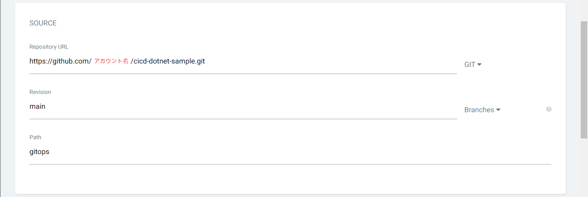

続いて、[DESTINATION]の各項目に値を設定します。

|項目|入力値|
|--|--|
|Cluster URL|https://kubernetes.default.svc|
|Namespace|dojo|


最後に、[DIRECTORY]の[DIRECTORY RECURSE]にチェックを入れ、[CREATE]をクリックします。


pipeline-dotnet-sample というアプリケーションが作成されていれば、ArgoCDでのアプリセットアップは完了です。


### 4.2 GitHubとArgoCDの同期設定

作成したアプリケーションの[Status]を確認すると、[SYNC STATUS]が「OutOfSync」となっています。

つまり、今はGitリポジトリと同期されていない（＝差分がある）状態なので、同期します。

まず、アプリケーションの左下にある[SYNC]をクリックします。

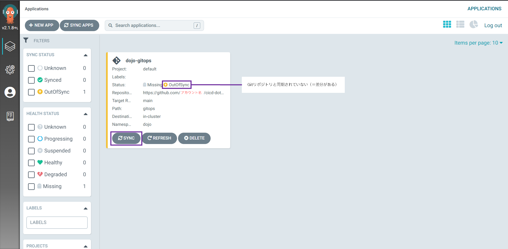

同期メニューが表示されるので、左上の[SYNCHRONIZE]をクリックすると、同期が始まります。

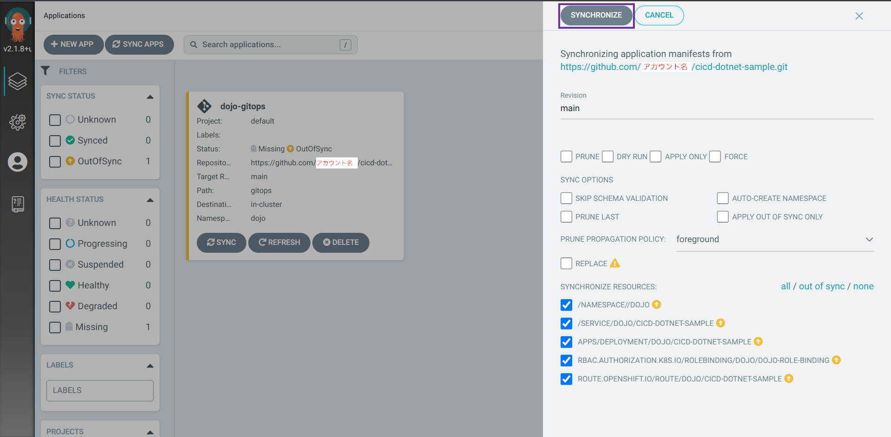

[Status]の[SYNC STATUS]が「Synced」となれば、同期はできています。

[Status]の[HEALTH STATUS]が「Healty」となれば、その同期処理は正常に行われ、アプリケーションがデプロイされています。


デプロイ結果の確認のため、OpenShiftのWebコンソールへ戻ります。

左上のメニューが[管理者]になっている方は、[管理者]から[Developer]に切り替えます。

メニューから[トポロジー]をクリックし、中央上の[プロジェクト]を dojo に変更します。

pipeline-dotnet-sample というデプロイメントが存在していれば成功です。


今回は手動で同期を行いましたが、CD（継続的デプロイ）を行えるようにArgoCDの設定を変更します。

ArgoCDの画面に戻り、アプリケーション dojo-gitops をクリックします。

アプリケーションの関連が表示されるので、左上にある[APP DETAILS]をクリックします。

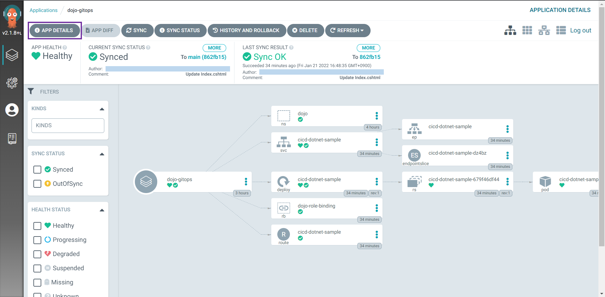

[SUMMARY]タブの下部にある[ENABLE AUTO-SYNC]をクリックします。

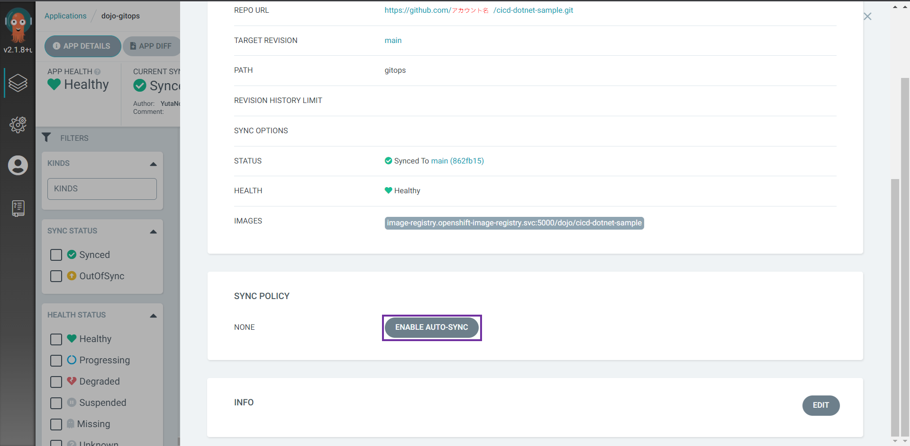

確認メッセージが表示されるので、[OK]をクリックします。

以上で、CDのための準備ができました。

## 5. CDの動作確認

再度、ご自身のmainブランチの [/SampleApp/Pages/Index.cshtml](/SampleApp/Pages/Index.cshtml) を更新します。
右上にある Editボタン から直接変更し、画面下部の [Commit changes]を押してください。
> 本来であれば feature_dojoブランチ で変更し、問題ないことを確認した後に mainブランチ へマージする流れとなります。

```html
@page
@model IndexModel
@{
    ViewData["Title"] = "Sample page";
}

<div class="text-center">
    <h1 class="display-4">Welcome</h1>
    <p>This application is sample for Tech Dojo - OpenShift Pipeline/GitOps</p>
    <p>mainブランチのトリガー動作確認</p>
    <p>ArgoCDの自動デプロイ動作確認</p> <!-- この行を追加 -->
</div>
```

OpenShiftの画面に戻り、[Developer]から[管理者]に切り替えて、[パイプライン]をクリックし、**pipeline-dotnet-sample-git** の完了を待ちます。
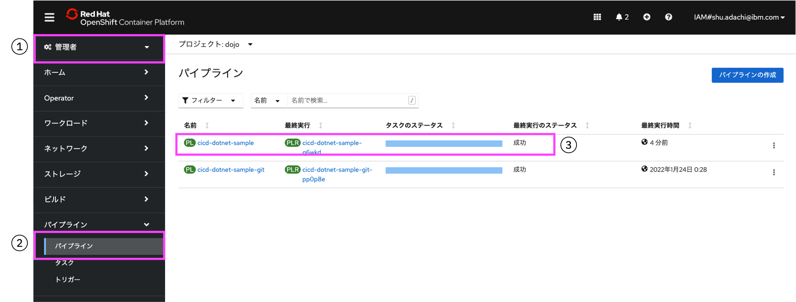

パイプラインの完了を確認したら、[ビルド] > [イメージストリームタグ] > **pipeline-dotnet-sample** のリンクをクリックします。

イメージストリームの詳細画面が表示されたら、YAMLタブをクリックし、dockerImageReferenceに記載されているパラメータをコピーします。
> 複数存在しますが、先頭のものが一番最新のイメージとなるので、2つ目以降の値は使用しないでください。

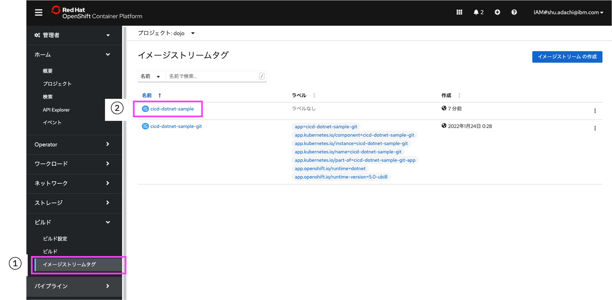

GitHubリポジトリに移動し、**mainリポジトリ** の [/gitops/dotnet-sample-deployment.yaml](/gitops/dotnet-sample-deployment.yaml)  を更新します。
右上にある Editボタン から直接変更し、画面下部の [Commit changes]を押してください。

```yaml
---
kind: Deployment
apiVersion: apps/v1
metadata:
  name: pipeline-dotnet-sample
  namespace: dojo
spec:
  replicas: 1
  selector:
    matchLabels:
      app: pipeline-dotnet-sample
  template:
    metadata:
      labels:
        app: pipeline-dotnet-sample
        deploymentconfig: pipeline-dotnet-sample
    spec:
      containers:
        - name: pipeline-dotnet-sample
          image: # ここに先ほどコピーしたコンテナイメージをペースト　(image-registry.openshift-image-registry.svc:5000/dojo/pipeline-dotnet-sample@sha256:xxx...)
・
・
・
```

更新ができたらArgoCDの画面に移動し、同期が開始・完了することを確認します。
> 3分周期で同期をしているので少し時間がかかる可能性があります。

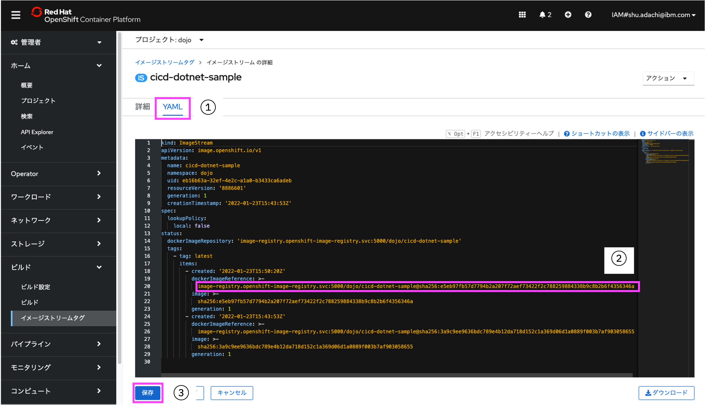

ArgoCDの同期が完了したらアプリケーションを確認します。
OpenShiftの画面に戻り、[管理者]から[Developer]に切り替えて、[トポロジー]をクリックして　**pipeline-dotnet-sample**　のルートからアプリケーションを開きます。
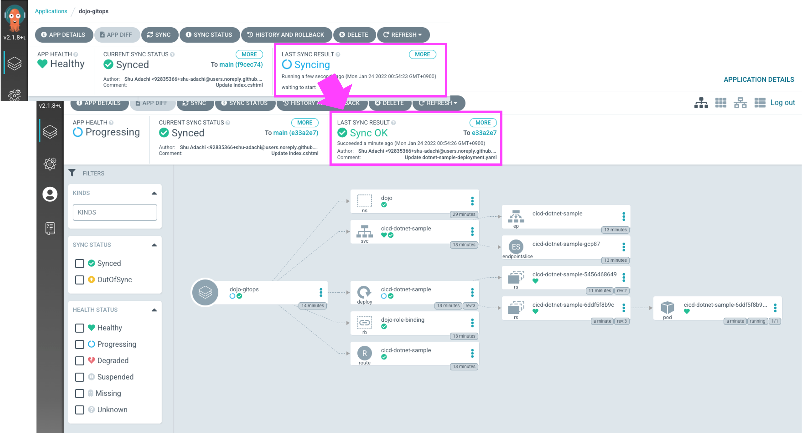

アプリケーションが更新されていることが確認できましたでしょうか。

以上で、本ハンズオンは終了となります。
